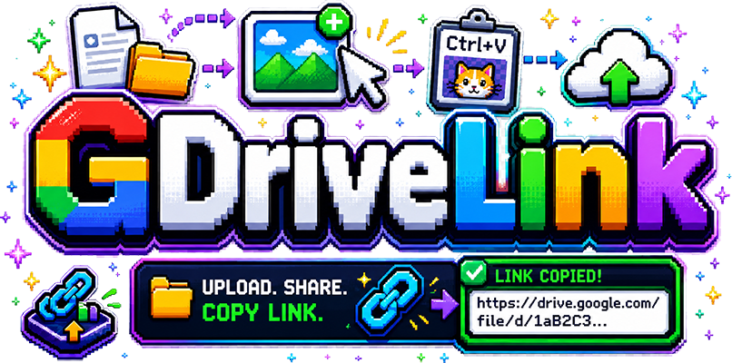
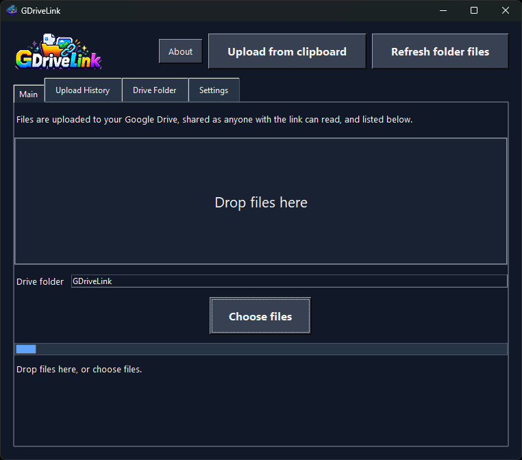

# GDriveLink



GDriveLink is a small Python desktop app for quickly turning local files and clipboard images into Google Drive share links. Drop files into the app, or press `Ctrl+V` to preview and upload a copied image. Uploads go into a configurable Drive folder, are shared as `anyone with the link can read`, and the resulting link is copied to the clipboard.

The app also keeps local upload history in `upload_history.json` and includes a Drive Folder tab with compact file cards for refreshing the selected Drive folder, viewing each file's current sharing status, and copying links from existing Drive files after ensuring link sharing is enabled.



## Download

[GDriveLink.exe](https://github.com/jamps3/GDriveLink/blob/main/dist/GDriveLink-v1.1.0/GDriveLink.exe)

## Setup

1. Create a Google Cloud project.
2. Enable the Google Drive API.
3. Configure the OAuth consent screen.
4. Create an OAuth client ID for a **Desktop app**.
5. Download the client JSON and save it in this folder as `credentials.json`.
6. Create and activate a virtual environment:

```powershell
py -3.14 -m venv .venv
.\.venv\Scripts\Activate.ps1
```

7. Install dependencies:

```powershell
python -m pip install -r requirements.txt
```

## Run

```powershell
.\.venv\Scripts\python.exe gdrivelink.py
```

On first run, Google opens an OAuth sign-in page. After authorization, the app stores `token.pickle` beside the script so future uploads do not need another sign-in. If the token expires or is revoked the app will automatically prompt for re-authorization (opening the sign-in URL in your browser).

You can also copy an image to the clipboard and press `Ctrl+V` in the app. The app shows a preview first. You can edit the filename, then pressing OK uploads the image as a PNG and copies the share link to the clipboard.

## VS Code

Open this folder in VS Code. The included `.vscode/settings.json` automatically selects the virtual environment Python interpreter. Press F5 to run `gdrivelink.py` using the configured launch settings.

## Build

Install PyInstaller into the virtual environment:

```powershell
.\.venv\Scripts\python.exe -m pip install pyinstaller
```

Build the Windows app:

```powershell
.\build.ps1
```

Build the Linux app:

```bash
chmod +x ./build-linux.sh
./build-linux.sh
```

Each build increments `VERSION` and creates a versioned release directory with a stable executable name:

```text
dist\GDriveLink-v1.0.6\GDriveLink.exe
dist/GDriveLink-v1.0.6/GDriveLink
```

The build scripts copy `README.md` and `LICENSE` into the release directory. The app requires a user-specific `credentials.json` file (obtained from Google Cloud Console during setup) placed beside the executable. Runtime files such as `token.pickle`, `upload_history.json`, and `settings.json` are user-specific and not distributed with releases. Users obtain or migrate these files as needed.

## System Tray Icon

The app keeps a system tray icon visible in the taskbar notification area while it is running. Left-click the tray icon to show the app window. You can also right-click the icon to access a menu with options to Show the app window, paste a link, or Quit the app.

Use Settings -> Startup -> Open with OS to launch GDriveLink automatically when you sign in.

## Notes

- Verified with Python 3.14.5 in `.venv`.
- The app window uses `assets/gdrivelink.ico` as its program icon.
- Uploaded files are created in the Drive folder shown in the app. The default folder is `GDriveLink`.
- If the configured Drive folder does not exist, the app creates it.
- Successful uploads are saved to `upload_history.json` and loaded into the Upload History tab on startup.
- The Drive Folder tab shows compact cards for files currently present in the selected Drive folder, including their current link-sharing status.
- Copying a link from a Drive Folder card first changes that file to `anyone with the link can read`, then copies the link.
- Deleting a file from a Drive Folder card moves it to Google Drive trash and removes it from the current view.
- The app requests the `drive.file` scope, so it can manage files it creates or files the user explicitly opens with the app.
- Delete `token.pickle` to sign in with a different Google account.

## License

This project is source-available under the PolyForm Noncommercial License 1.0.0.

You may use, study, modify, and share this software for non-commercial purposes.

Commercial use, including use by companies, use in paid services, resale, SaaS integration, or use in revenue-generating products, requires separate written permission from the author.